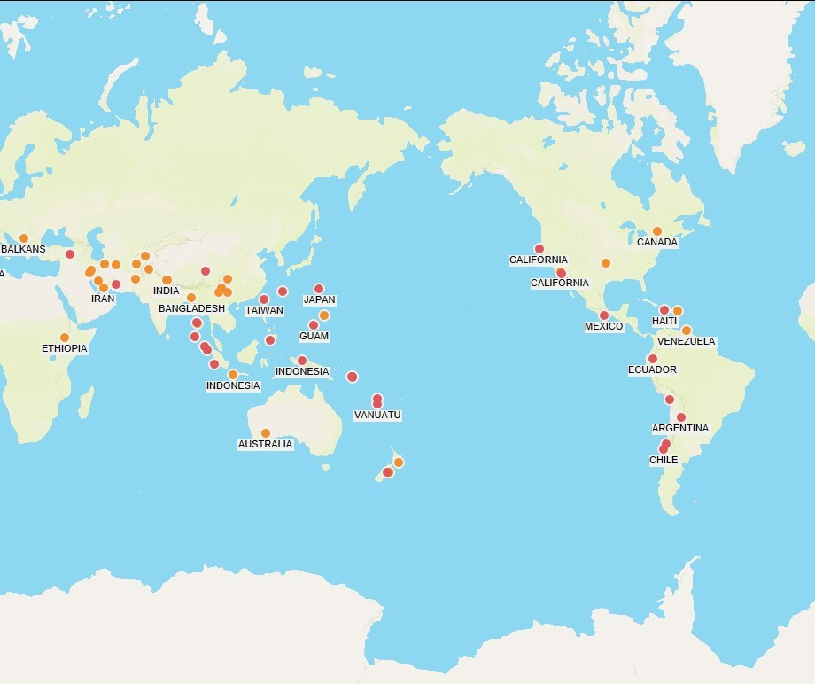

#   Portfolio

---

## Projects

### [1. City of Melbourne_Pedestrian and Street Furniture](/sample_page)

<a href="https://public.tableau.com/profile/aqsa7618#!/vizhome/CityofMelbourneStreetfurniturePedestrianTraffic/pedestriansensor_info" target="_blank" rel="noopenernoreferrer">View Project in Tableau</a> 

<a href="https://public.tableau.com/profile/aqsa7618#!/vizhome/Interactivedashboard_CityofMelbournePedestrianandStreetAsset/ConditionofStreetFurnitureacrossCity" target="_blank" rel="noopenernoreferrer">View Project Intereactive Dashboard in Tableau</a> 

<a href="https://github.com/aqsaajaz/City-of-Melbourne.git" target="_blank" rel="noopenernoreferrer">View Dataset and source code</a>

### [2. Road Accidents Victoria](/pdf/sample_presentation.pdf)

<a href="https://public.tableau.com/profile/aqsa7618#!/vizhome/RoadAccidentVictoria/RoadAccidentVictoria" target="_blank" rel="noopenernoreferrer">View Project in Tableau</a> 

<a href="https://github.com/aqsaajaz/Road-Accidents-Victoria" target="_blank" rel="noopenernoreferrer">View Dataset and source code</a>

### [3. Climate Change-Middle East](http://example.com/)

<a href="https://public.tableau.com/profile/aqsa7618#!/vizhome/MiddleeastClimateChange-1901-2016/PopulationofMiddleEast" target="_blank" rel="noopenernoreferrer">View Project in Tableau</a> 

<a href="https://github.com/aqsaajaz/Middle-East-Climate-Change" target="_blank" rel="noopenernoreferrer">View Dataset and source code</a>

### [4. World Earthquakes ](http://example.com/)

<a href="https://public.tableau.com/profile/aqsa7618#!/vizhome/WorldEarthquakes2000-2020/EarthquakesaroundtheWorld" target="_blank" rel="noopenernoreferrer">View Project in Tableau</a> 

<a href="https://github.com/aqsaajaz/World-Earthquakes" target="_blank" rel="noopenernoreferrer">View Dataset and source code</a>

----

### [5. Bike Share Organisation](/sample_page)

<a href="https://github.com/aqsaajaz/Bike-sharing-organisation" target="_blank" rel="noopenernoreferrer">View Dataset and source code</a>

---

Page template forked from <a href="https://github.com/evanca/quick-portfolio">evanca</a>

<!-- Remove above link if you don't want to attibute -->
